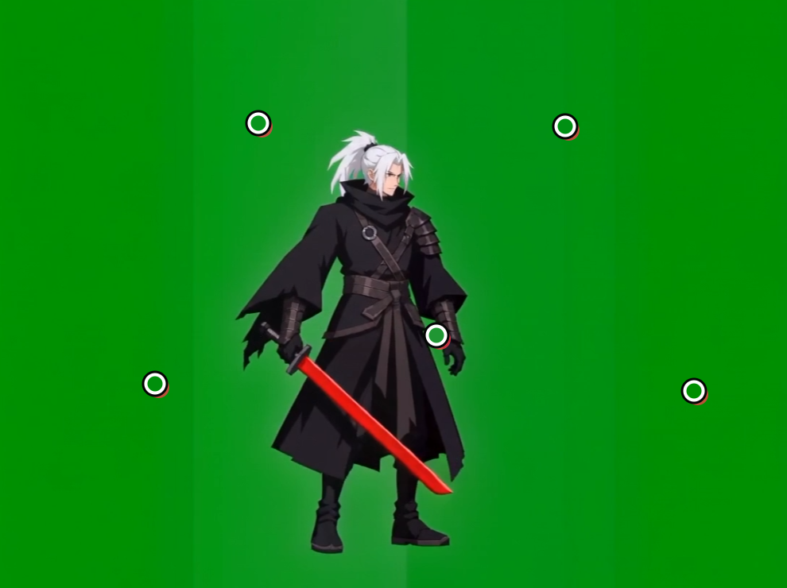
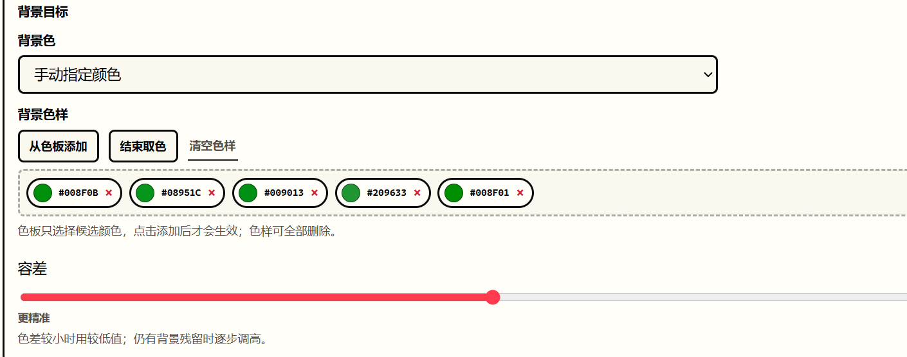

# Sprite Video Lab

Sprite Video Lab 是一个在本机运行的网页工具，用来把视频、GIF、单张图片或图片序列整理成可预览、可筛选、可缩放和可导出的 2D Sprite 资源。

项目优先服务 Windows 工作流。基础处理由 Python、Pillow、ffmpeg 和原生 HTML/CSS/JavaScript 完成；BiRefNet、EZ-CorridorKey 和 Real-ESRGAN 均为可选能力。

## 当前重点

- `Chroma` 支持绿幕、蓝幕、白底、灰底等受控纯色背景，可自动取色，也可从画面或色板添加最多 12 个背景色样。
- `CorridorKey` 与 `CorridorKey（蓝幕）` 是两个独立入口，分别使用对应的绿幕或蓝幕模型。
- 输入 PNG 已有透明通道时，Chroma 只会继续降低原 Alpha，不会把原本透明的隐藏 RGB 重新变成黑色背景。
- CorridorKey 使用 Chroma 粗遮罩时，会继承当前 Chroma 的取色方式、全部手动色样和容差。
- 可选“去水印”，逐帧检测左上角或右下角水印区域，并将检测到的角落区域清为透明。
- AI 模型权重不随仓库或便携包分发。只有实际选择 BiRefNet 或某个 CorridorKey 模式、并在弹窗中确认后，才会下载该次需要的模型。
- 原始处理结果始终保留；缩放处理可额外生成 100%、1/2、1/4、1/8 版本，并独立导出。

历史变更记录见 [CHANGELOG.md](./CHANGELOG.md)。

## 使用流程

主要流程分为三步：

1. 导入并截取素材。
2. 选择去背景方式，预览当前帧后处理整个区间。
3. 检查、筛选和预览帧，再直接导出或进行缩放处理。

## 支持的输入与输出

输入：

- 本地视频：MP4、MOV、MKV、WebM。
- GIF 动图。
- 单张 PNG、JPG、JPEG、WebP、BMP。
- 一次上传的多张图片或本地图片文件夹，按文件名顺序组成序列。

输出：

- `Frames`：透明 PNG 序列，并附带记录最终顺序和逐帧时长的 `frames.json`。
- `Spritesheet`：固定网格图集及对应的坐标、尺寸和时长 JSON。
- `透明 MOV`：用于保留完整 Alpha 的视频输出。
- `GIF`：用于快速预览，不适合保存高质量半透明边缘。

应用只生成本次明确选择的格式。导出完成后会直接打开对应文件夹。

## 去背景模式

| 处理方式 | 适合素材 | 模型与下载行为 |
| --- | --- | --- |
| `Chroma` | 绿幕、蓝幕、白底、灰底及其他纯色背景 | 不需要模型，不会触发模型下载 |
| `Luma` | 黑底或白底的火焰、闪电、粒子、发光 VFX | 不需要模型，不会触发模型下载 |
| `BiRefNet` | 真实背景、AI 生成背景或非纯色背景 | 首次选择时检查 HR-matting；缺失时先询问，确认后才下载 |
| `CorridorKey` | 标准绿幕，需要重建边缘颜色或清理绿色溢色 | 只检查并下载绿幕 CorridorKey checkpoint |
| `CorridorKey（蓝幕）` | 标准蓝幕，需要重建边缘颜色或清理蓝色溢色 | 只检查并下载蓝幕 CorridorKey checkpoint |
| `不抠图` | 已有透明素材，或只需要截帧、后处理、缩放和导出 | 不需要模型，不会触发模型下载 |

CorridorKey 的粗遮罩来源可以选择：

- `Chroma`：复用当前 Chroma 取色方式、全部色样和容差，速度更快。
- `BiRefNet`：同时需要 BiRefNet HR-matting 和当前幕布颜色对应的 CorridorKey 模型。

选择任何需要模型的方式时，应用先调用本地状态检查。只有模型缺失且用户确认安装后，才会进入下载接口；取消后会恢复之前的处理方式。实际推理只读取本地缓存，不会在处理过程中静默联网补模型。

AI 运行环境、缓存位置和许可证说明见 [AI_MATTING.md](./AI_MATTING.md)。

## Chroma 使用

Chroma 支持自动取背景色和手动多色样：

1. 选择 `Chroma`。
2. 背景色选择“手动指定颜色”。
3. 使用“从画面添加”连续点击亮色、暗色和存在色差的背景区域，或从色板添加颜色。
4. 调整容差，通过浏览器即时预览确认主体、武器和衣摆没有被误删。
5. 确认后预览当前帧或开始处理区间。

手动模式最多保存 12 个唯一色样，允许删除单个色样或全部清空。即时预览在浏览器本地计算，不会重置当前缩放、平移或页面位置。





### 已有透明背景的输入

如果输入帧存在透明像素，Chroma 会把新计算的 Alpha 与输入 Alpha 相乘：

```text
输出 Alpha = 输入 Alpha × Chroma Alpha
```

因此 Chroma 仍能继续扣除画面中剩余的蓝幕或绿幕对象，但不能把输入中已经透明的区域重新变成不透明黑底。完全不透明的普通幕布素材仍使用原来的 Chroma 行为。

## CorridorKey 使用

绿幕选择 `CorridorKey`，蓝幕选择 `CorridorKey（蓝幕）`。两个入口会分别保存并传递正确的幕布颜色，也只检查对应 checkpoint。

推荐流程：

1. 先在 `Chroma` 中调好自动或手动取色、全部背景色样和容差。
2. 切换到对应颜色的 CorridorKey。
3. 将“粗遮罩来源”设为 `Chroma`。
4. 根据需要调整边缘去溢色、边缘细化、去散点和垃圾遮罩。
5. 开启即时预览或点击“预览当前帧”检查结果，再处理整个区间。

如果 Chroma 粗遮罩无法稳定覆盖复杂主体，可以将粗遮罩来源改为 `BiRefNet`，但这会额外需要 BiRefNet 模型。

## 去水印

“去水印”是一个可选的逐帧后处理：

- 当前实现只检测左上角和右下角。
- 检测到角落水印后，会将对应的固定角落区域清为透明。
- 没有达到检测阈值的帧不会修改。
- 该功能可能同时清除角落中的正常画面内容，批处理前应先预览代表帧。

它不会调用在线服务，也不会上传素材。

## 预览、后处理与帧筛选

- 预览当前帧时，左侧显示原始抽帧，右侧显示处理结果。
- 两侧预览均支持缩放、拖动和归位。
- 结果背景可切换为棋盘格或指定纯色，便于检查透明边缘。
- 可将识别到的背景残留转黑或把饱和度归零。
- 可将半透明像素涂黑，或将半透明像素转为不透明。
- 可全选、全不选、选择奇数帧或偶数帧、反选，并按选择顺序组织动画。
- 支持正向或反向动画预览和导出。

## 缩放处理

在“帧检查与导出”区域点击“缩放处理”后，可以为当前选中帧生成多个独立版本：

- `100%`：保持原画布尺寸；启用 Real-ESRGAN 时先放大 4 倍再缩回原尺寸。
- `1/2`：输出宽高均为原尺寸的 1/2。
- `1/4`：输出宽高均为原尺寸的 1/4。
- `1/8`：输出宽高均为原尺寸的 1/8。

缩放算法：

- `硬`：nearest-neighbor，适合需要硬边缘的像素或 Sprite 动画。
- `软`：BOX，适合更柔和的抗锯齿结果。

未处理原版始终保留。每个处理版本都有独立导出入口；更新缩放处理时，只补算新增帧或新增尺寸，未变化的结果会复用缓存。


“先做平滑处理”会在抠图前用 Real-ESRGAN anime x4 放大每帧，再通过 Lanczos 缩回原尺寸，然后进入抠图。它不会改变最终画布尺寸，但会显著增加处理时间。缺少 Real-ESRGAN Windows 便携包时，也只有勾选该功能并确认后才会安装。

## 快速开始

### 交给 Agent 安装

推荐让本地编码 Agent 按 [AGENT_INSTALL.md](./AGENT_INSTALL.md) 完成依赖检查、安装、启动和验证，避免覆盖已有工作目录或模型缓存。

### 手动安装基础环境

要求：

- Windows。
- Python 3.10 或更高版本。
- ffmpeg 与 ffprobe。

在 PowerShell 中执行：

```powershell
py -3 -m venv .venv
.\.venv\Scripts\python.exe -m pip install --upgrade pip
.\.venv\Scripts\python.exe -m pip install -r requirements.txt
```

确保 `ffmpeg` 和 `ffprobe` 已在 `PATH`，或者把它们所在目录写入 `SPRITE_VIDEO_LAB_FFMPEG_DIR`。然后启动：

```powershell
$env:SPRITE_VIDEO_LAB_PYTHON = (Resolve-Path .\.venv\Scripts\python.exe).Path
.\start_sprite_video_lab.bat
```

启动器依赖同目录下的 `wait_for_server.ps1` 等待服务就绪后再打开浏览器，请勿单独移动 `.bat` 文件。

也可以直接运行：

```powershell
.\.venv\Scripts\python.exe server.py --serve --host 127.0.0.1 --port 8894
```

默认地址：

```text
http://127.0.0.1:8894/
```

实验性线稿清理页：

```text
http://127.0.0.1:8894/app/line-cleaner-experiment.html
```

### 可选 AI 环境

只有确定需要 BiRefNet 或 CorridorKey 时才运行：

```bat
setup_ai_runtime.bat
```

该脚本安装 AI Python 依赖并准备固定 revision 的 EZ-CorridorKey 源码，但不会预下载 BiRefNet、绿幕 CorridorKey 或蓝幕 CorridorKey 权重。之后首次在页面中选择具体 AI 模式时，应用仍会先征求确认，并且只下载当前选择所需的权重。

### 便携版

便携版包含 Python、ffmpeg、AI 依赖和 CorridorKey 支持代码，但不包含任何 AI 模型权重。解压后运行：

```text
start_sprite_video_lab_portable.bat
```

便携版启动器同样需要 `wait_for_server.ps1` 位于同一目录。

## 环境变量

| 变量 | 用途 |
| --- | --- |
| `SPRITE_VIDEO_LAB_HOST` | 服务地址，默认 `127.0.0.1` |
| `SPRITE_VIDEO_LAB_PORT` | 服务端口，默认 `8894` |
| `SPRITE_VIDEO_LAB_ALLOWED_HOSTS` | 额外允许的请求主机名或 IP，多个值以逗号分隔；默认回环地址无需配置 |
| `SPRITE_VIDEO_LAB_MAX_UPLOAD_BYTES` | 上传请求体字节上限，必须为正整数，默认 8 GiB |
| `SPRITE_VIDEO_LAB_WORK_DIR` | 上传、任务、缓存和导出等运行时文件目录 |
| `SPRITE_VIDEO_LAB_FFMPEG_DIR` | 包含 `ffmpeg.exe` 和 `ffprobe.exe` 的目录 |
| `SPRITE_VIDEO_LAB_FFMPEG_ACCEL` | ffmpeg 加速方式：`auto`、`cpu`、`cuda`、`qsv`、`d3d11va`、`dxva2` |
| `SPRITE_VIDEO_LAB_AI_MODEL_CACHE` | Hugging Face / BiRefNet 模型缓存目录 |
| `SPRITE_VIDEO_LAB_CORRIDORKEY_ROOT` | EZ-CorridorKey 源码和 checkpoint 根目录 |
| `SPRITE_VIDEO_LAB_PYTHON` | 启动器使用的 Python 可执行文件 |
| `SPRITE_VIDEO_LAB_REALESRGAN_BIN` | `realesrgan-ncnn-vulkan.exe` 的路径 |
| `SPRITE_VIDEO_LAB_REALESRGAN_MODEL_DIR` | Real-ESRGAN `.param` 与 `.bin` 模型目录 |

绑定 `0.0.0.0` 或 `::` 不会自动信任任意请求主机。使用通配地址监听时，需通过 `SPRITE_VIDEO_LAB_ALLOWED_HOSTS` 明确列出浏览器实际访问的主机名或 IP；仅在本机回环地址使用时无需额外配置。

## 项目结构

```text
app/                                 前端 UI、浏览器逻辑和实验页面
docs/                                README 截图
tests/test_ai_matte_sizing.py        后端与处理流水线回归测试
server.py                            本地 HTTP 服务和媒体处理流水线
requirements.txt                    基础运行依赖
requirements-ai.txt                 可选 AI 依赖
start_sprite_video_lab.bat           Windows 普通启动器
start_sprite_video_lab_portable.bat  Windows 便携版启动器
setup_ai_runtime.bat                 可选 AI 环境安装脚本
wait_for_server.ps1                  启动器使用的服务就绪探测脚本
build_portable_bundle.ps1            便携版打包脚本
AGENT_INSTALL.md                     Agent 安装与验证说明
AI_MATTING.md                        AI 模型、缓存和许可证说明
CHANGELOG.md                         版本变更记录
work/                                默认运行时目录，已被 Git 忽略
```

## 开发验证

```powershell
node --check app/app.js
python -m py_compile server.py
python -m unittest tests.test_ai_matte_sizing
git diff --check
```

## 注意事项

- 不要把 `work/`、上传素材、生成帧、模型缓存、虚拟环境或测试媒体提交到 Git。
- 模型状态检查不会下载文件；安装接口要求显式确认。
- Chroma、Luma 和“不抠图”不会触发 AI 模型安装。
- BiRefNet 推理使用 `local_files_only=True`，不会在处理时静默下载缺失文件。
- 便携包会剔除 Hugging Face 缓存和 CorridorKey checkpoint。
- BiRefNet 使用固定 revision 的 HR-matting 模型；升级模型或 CorridorKey 源码时应显式修改 revision 并重新测试。
- EZ-CorridorKey 采用独立许可证。重新分发其源码、模型或用于商业推理服务前，请先确认上游许可条件。

## License

[MIT](./LICENSE)
